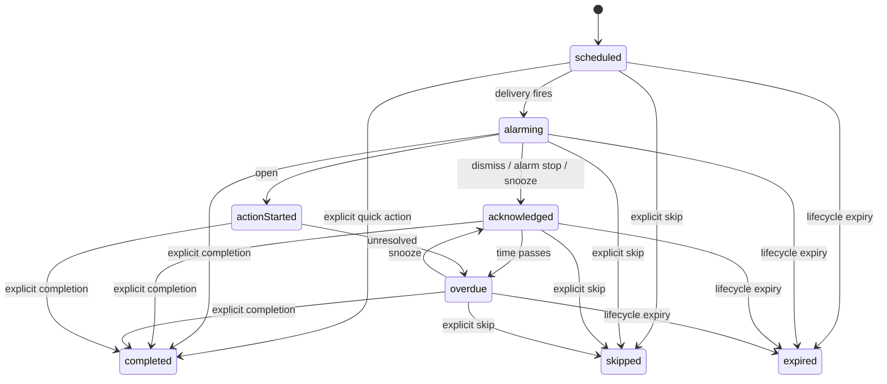
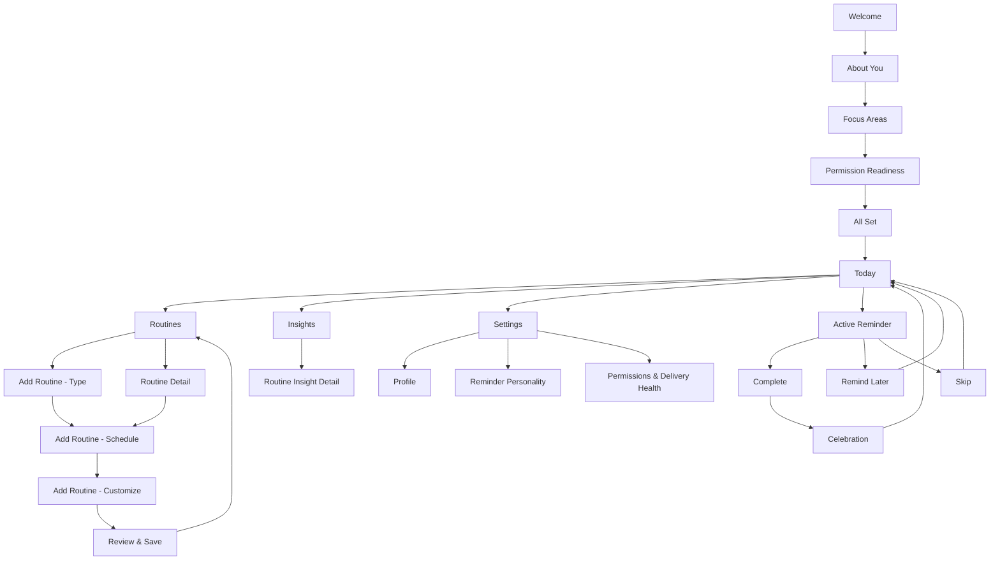

# Jomado — Canonical Product, UX & Technical Specification
**Fresh-start implementation blueprint**  
**Version:** 2.0 — FINAL  
**Date:** 2026-09-27  
**Target:** iOS 26+  
**Status:** FINAL canonical source of truth for a fresh implementation

> **Finalization note:** This revision closes the remaining product-definition gaps around personality, emotional tone, strictness/intensity, non-repetitive local content, versioned content refresh, mascot asset packs, localization, safety/governance, and release/update behavior. Treat the rules marked **non-negotiable** as invariants.

---

## 0. How to use this document

This file is intended to be uploaded into a new project and treated as the **primary product and engineering specification** for Jomado.

The implementation should **not restart product discovery or redesign the core concept** unless development exposes a concrete technical contradiction. The visual direction is the finalized pastel/cute Jomado mockup family: bright outdoor backgrounds, large friendly mascot illustrations, rounded white cards, bold navy typography, cyan primary actions, colorful routine icons, and an Uber-style persistent Lock Screen / Dynamic Island status experience.

The application is **not a hydration-only app**. Hydration is the first and most-developed routine, but the core product is a **local-first daily wellness routine companion** that supports hydration, exercise, stretching, eye care, posture, breathing, meditation, yoga, sleep, and custom habits.

The central product promise is:

> **Small habits. A healthier, happier you — with reminders people actually enjoy seeing.**

Jomado should feel more like a cute companion than a task manager.

---

# 1. Product vision

## 1.1 What Jomado is

Jomado is an iOS wellness routine companion that helps people build small daily habits through:

- attractive, personalized reminders;
- a lovable mascot;
- local-first content;
- configurable routines;
- Lock Screen Live Activities;
- Dynamic Island status;
- optional prominent alarms;
- gentle urgency escalation;
- explicit completion tracking;
- positive celebration;
- simple local insights.

The product is designed around the idea that **people ignore boring reminders but return to experiences they enjoy**.

Jomado therefore treats the reminder itself as a small piece of delightful product content.

## 1.2 What Jomado is not

Jomado is not:

- a medical diagnosis product;
- a calorie tracker;
- a clinical treatment app;
- a generic to-do list;
- an AI chatbot;
- a cloud-first social network;
- a guilt-based habit app;
- an app that assumes silencing a reminder means the habit was completed.

MVP explicitly excludes:

- camera proof / AI verification;
- automatic proof of consumption or exercise;
- social feeds;
- leaderboards;
- mandatory accounts;
- cloud sync;
- generative AI content;
- automatic medical recommendations.

---

# 2. Non-negotiable behavioral rule

This is the most important invariant in the entire system.

## 2.1 Completion semantics

A routine occurrence is **completed only through an explicit completion action**.

Examples:

| Routine | Explicit completion label |
|---|---|
| Hydration | **I drank water** |
| Exercise | **Workout done** |
| Stretching | **Done stretching** |
| Eye Care | **Took my eye break** |
| Posture | **Posture reset done** |
| Breathing | **Breathing done** |
| Meditation | **Meditation complete** |
| Yoga | **Yoga done** |
| Sleep / wind-down | **Started wind-down** |
| Custom | User-defined or template-defined completion label |

The following actions **must never mark an occurrence complete**:

- silence alarm;
- stop alarm;
- dismiss notification;
- close Live Activity;
- open app;
- tap notification;
- acknowledge;
- snooze;
- “Remind me later”;
- leave the reminder screen.

### Terminal states

- `completed`
- `skipped`
- `expired`

### Nonterminal states

- `scheduled`
- `alarming`
- `acknowledged`
- `overdue`
- `actionStarted`

A snoozed/remind-later occurrence stays unresolved.

---

# 3. Core product principles

## 3.1 Cute first, but useful

Mascot and content are functional, not decorative.

They should:

- make reminders emotionally pleasant;
- reduce reminder fatigue;
- communicate urgency visually;
- make progress feel rewarding;
- give the product a recognizable personality.

## 3.2 Positive reinforcement, never shame

Jomado can be funny and dramatic, but never hostile.

Allowed:

- “Momo has entered dramatic mode 🚨”
- “Tiny reminder. Big hydration energy.”
- “Your eyes have filed a tiny vacation request.”

Avoid:

- guilt;
- health fear;
- moral judgment;
- insults;
- manipulative streak loss threats.

“Dramatic” means theatrical/cute, not punitive.

## 3.3 Glanceable first

The most important information should be understandable in under two seconds:

- what habit?
- due now or late?
- how late?
- what should I do?
- what is the next action?

## 3.4 Local-first by default

The product should work fully offline for its essential behavior.

Core reminder delivery, routines, content selection, completion state, insights, and mascot content should not depend on a server.

---

# 4. Why local-first is a core product decision

The local-first strategy is deliberate.

## 4.1 Reliability

Daily habits should not stop because:

- internet is unavailable;
- a backend is down;
- a user is traveling;
- an API is slow.

System-scheduled local notifications and alarms are handled by iOS after they are registered.

## 4.2 Privacy

The most personal information can stay on device:

- routine schedule;
- age group;
- gender selection;
- wellness goals;
- completion history;
- reminder response behavior;
- reminder-style preferences;
- mascot preferences.

No account should be required for V1.

## 4.3 Speed

Content selection is immediate.

No reminder needs a network round trip before displaying a message.

## 4.4 Cost

Large reminder volume should not create backend inference or content-generation cost.

## 4.5 Brand consistency

Curated local content gives Jomado a consistent voice.

A generative system may create:

- inconsistent tone;
- inappropriate urgency;
- repetitive output;
- unsafe wellness advice;
- messages that do not fit the mascot.

The MVP instead uses a **curated content catalog**.

## 4.6 Deterministic testing

A local content engine is testable.

Given:

- routine type;
- urgency;
- style;
- previous content history;

the selection engine can be validated deterministically.

---

# 5. Platform baseline

Use the current Apple-native stack.

## 5.1 Technology

- **Swift 6**
- **SwiftUI**
- **SwiftData**
- **ActivityKit**
- **WidgetKit**
- **AlarmKit**
- **UserNotifications**
- **AppIntents**
- **App Groups** for app / widget / intent-safe shared event transfer
- **XCTest / Swift Testing**
- optional **XcodeGen** for reproducible project generation

Recommended minimum platform:

> **iOS 26+**

This intentionally prioritizes the modern AlarmKit and scheduled Live Activity experience instead of carrying a large compatibility layer.

---

# 6. Information architecture

Use four persistent primary tabs:

1. **Today**
2. **Routines**
3. **Insights**
4. **Settings**

Do not make “Vibe” a mandatory fifth tab.

Mascot/tone personalization is important but belongs in:

- routine customization;
- Settings → Reminder Personality;
- mascot tap / “Get a Nudge” quick interaction on Today.

This keeps the core navigation easy to understand.

---

# 7. Complete screen inventory

The new project should implement the following screens/states.

## Onboarding

1. Welcome
2. About You
3. Focus Areas
4. Permission Readiness
5. System Permission Sheet(s)
6. All Set

## Main application

7. Today / Home
8. Routines List
9. Add Routine — Choose Type
10. Add Routine — Schedule
11. Add Routine — Customize
12. Add Routine — Review & Save
13. Routine Detail / Edit
14. In-App Reminder
15. Completion / Celebration
16. Insights Overview
17. Insights Routine Detail
18. Settings
19. Reminder Personality / Mascot Settings
20. Permissions & Delivery Health
21. Empty State — No Routines
22. Empty State — No Insight Data

## System surfaces

23. Standard local notification fallback
24. AlarmKit presentation
25. Lock Screen Live Activity
26. Dynamic Island — compact
27. Dynamic Island — expanded
28. Live Activity urgency variants
29. Completed Live Activity state

These are separate UX states even when implemented by shared code.

---

# 8. Onboarding flow

## 8.1 Screen 1 — Welcome

### Purpose

Explain the idea quickly and emotionally.

### Content

Hero:

- Jomado wordmark
- large Momo animation/illustration
- message such as:
  - **Build healthy daily habits**
  - “Friendly reminders and gentle support for a healthier, happier you.”

Show examples:

- Hydration
- Stretching
- Eye care
- Breathing
- Meditation
- Posture
- Yoga
- Sleep
- Exercise

### Actions

**Get Started**
→ About You

**Learn More**
→ optional lightweight walkthrough modal / carousel  
→ returns to Welcome

Do not request permissions on this screen.

## 8.2 Screen 2 — About You

Collect personalization context.

### Age

Prefer **age group** rather than date of birth for V1:

- Under 18
- 18–24
- 25–34
- 35–44
- 45–54
- 55–64
- 65+

If minors are supported, product/legal requirements must be reviewed before using age for personalized wellness advice.

### Gender

Optional:

- Woman
- Man
- Non-binary
- Self describe
- Prefer not to say

Gender should never be required to use the app.

### Wellness goals

Multi-select:

- Stay healthy
- Be more active
- Reduce screen strain
- Improve focus
- Manage stress
- Build consistency
- Improve sleep
- Improve mobility

### Why collect it?

The UI should clearly say:

> “These details stay on your device and help personalize your experience.”

### Action

**Continue**
→ Focus Areas

## 8.3 Screen 3 — Focus Areas

Multi-select routine families.

Initial templates:

- Hydration
- Exercise
- Stretching
- Eye Care
- Posture
- Breathing
- Meditation
- Yoga
- Sleep
- Custom

Selecting a focus area does **not** immediately create a complex routine.

Instead, onboarding creates recommended starter routines after confirmation.

### Action

**Continue**
→ Permission Readiness

**Maybe later**
→ Permission Readiness with no templates preselected

## 8.4 Screen 4 — Permission Readiness

Explain permissions before iOS sheets appear.

Rows:

- Notifications
- Alarms & Alerts
- Live Activities

Each row includes:

- icon;
- one-line reason;
- current state.

### Important UX rule

Do not show all Apple system prompts simultaneously.

“Enable All” means:

1. explain notifications;
2. request notification permission;
3. after response, request AlarmKit authorization if relevant;
4. explain Live Activity setting/status.

### Actions

**Enable All**
→ sequential requests  
→ All Set

**Maybe Later**
→ All Set

Routine creation is never blocked simply because permission was denied.

## 8.5 Screen 5 — All Set

Celebration screen.

Shows:

- Momo celebrating;
- permission readiness summary;
- selected focus areas.

CTA:

**Start My Journey**
→ Today

---

# 9. Today / Home screen

Today should answer:

> “What should I do next?”

It should not become an administrative routine list.

## Hero

- friendly greeting;
- Momo current mood;
- current day progress.

Example:

**Good morning!**  
“A healthier, happier you is in the making.”

## Today progress card

- percentage or resolved count;
- completed;
- open;
- skipped;
- missed.

Important copy:

> “Silencing, dismissing, or snoozing never counts as completion.”

## Next Up card

Show the nearest upcoming or unresolved occurrence.

Example:

**Drink water**  
In 25 minutes · 10:00 AM

CTA:

**View**

## Quick actions

- Log / complete current habit where appropriate
- Start Stretch
- View Progress
- Get a Nudge

## Today's routines

Compact rows with:

- routine icon;
- title;
- schedule summary;
- progress count;
- progress ring;
- tap arrow.

Tap routine
→ Routine Detail

“See All”
→ Routines

---

# 10. Routines screen

Purpose: manage routine configuration.

## Tabs/filter

- All
- Active
- Paused

## Routine row

Contains:

- routine icon;
- name;
- short positive subtitle;
- schedule;
- enabled toggle;
- disclosure arrow.

Tap row
→ Routine Detail

Toggle
→ enable/disable  
→ immediately reconcile alarms, notifications, and scheduled Live Activities.

`+`
→ Add Routine — Choose Type

---

# 11. Generic multi-routine model

Do not make hydration assumptions in the domain model.

Use a template + instance architecture.

## 11.1 RoutineTemplate

Defines product defaults.

```text
RoutineTemplate
- id
- type
- displayName
- icon
- accentColor
- defaultCompletionLabel
- defaultReminderStyle
- supportedScheduleKinds
- defaultGoal
- contentPackID
- mascotBehaviorProfile
```

## 11.2 RoutineInstance

User-configured habit.

```text
RoutineInstance
- id
- templateID
- customName
- enabled
- icon
- color
- schedule
- deliveryMode
- reminderPersonality
- mascotID
- smartSnooze
- completionLabel
- goal
- createdAt
- updatedAt
```

## 11.3 Initial routine templates

### Hydration

Goal examples:

- every 60 minutes;
- 8 reminders/day.

Completion:

**I drank water**

### Exercise

Schedule:

- fixed time;
- one or multiple days.

Completion:

**Workout done**

### Stretching

Schedule:

- fixed times;
- interval window.

Completion:

**Done stretching**

### Eye Care

Default inspiration:

- every 20–60 minutes in a work window.

Completion:

**Took my eye break**

Do not claim medical benefit in reminder copy.

### Posture

Schedule:

- interval within work hours.

Completion:

**Posture reset done**

### Breathing

Schedule:

- fixed moments;
- interval;
- morning/evening.

Completion:

**Breathing done**

### Meditation

Schedule:

- fixed time.

Completion:

**Meditation complete**

### Yoga

Schedule:

- fixed time/days.

Completion:

**Yoga done**

### Sleep

Treat as a wind-down routine, not a sleep detector.

Completion:

**Started wind-down**

### Custom

User chooses:

- name;
- icon;
- color;
- schedule;
- completion label;
- reminder personality.

---

# 12. Add Routine flow

The add-routine experience is a four-step wizard.

This avoids placing every option on one dense screen.

## 12.1 Step 1 — Choose Type

Grid:

- Hydration
- Exercise
- Stretching
- Eye Care
- Yoga
- Posture
- Breathing
- Meditation
- Sleep
- Custom

Tap tile
→ selects type

**Next**
→ Schedule

Back
→ Routines

## 12.2 Step 2 — Schedule

A generic schedule engine must support at least two schedule modes.

### A. Window + interval

Examples:

- hydration;
- eye care;
- posture.

Inputs:

- start time;
- end time;
- interval;
- weekdays.

Example:

08:00 → 22:00  
Every 60 minutes  
Mon–Fri

### B. Fixed times

Examples:

- exercise at 18:00;
- meditation 07:00 and 21:00;
- sleep wind-down 22:30.

Inputs:

- one or more times;
- weekdays.

Future modes may include:

- times per day;
- after-wake relative schedule;
- after-completion interval;
- location context.

Do not add these until required.

**Next**
→ Customize

---

# 13. Routine customization

## Fields

- routine name;
- icon;
- accent color;
- completion label;
- reminder personality;
- mascot;
- smart snooze;
- goal;
- content-tip toggle.

## Reminder personalities

These are central to Jomado.

### Gentle

Tone:

- supportive;
- calm;
- warm.

Example:

> “A tiny reset might feel nice right now.”

Mascot:

- soft wave;
- smile;
- hopeful.

### Playful

Tone:

- cheerful;
- fun;
- energetic.

Example:

> “Momo has arrived with your tiny mission ✨”

Mascot:

- bounce;
- wave;
- sparkle.

### Cheeky

Tone:

- humorous;
- lightly sassy;
- never insulting.

Example:

> “Your water bottle is beginning to suspect you forgot it.”

Mascot:

- wink;
- side-eye;
- tiny pout.

### Dramatic

Opt-in only.

Tone:

- theatrical;
- exaggerated;
- cute urgency.

Example:

> “Momo has officially entered dramatic mode 🚨”

Mascot:

- panic wobble;
- wide eyes;
- dramatic pose.

Never use fear-based health claims.

### Focused

Tone:

- minimal;
- direct;
- professional.

Example:

> “Eye break due. Look away from the screen.”

Mascot:

- small;
- quiet;
- less visual movement.

---


## 13.1 Personality, emotion, language and strictness engine

The reminder personality system is a **core product subsystem**, not a cosmetic text preference.

A reminder is produced from several independent dimensions:

```text
Routine type
    ↓
Global personality default
    ↓
Per-routine personality override
    ↓
Intensity / strictness
    ↓
Urgency stage
    ↓
Time / context
    ↓
Recent-message history
    ↓
User preferences
    ↓
Final text + mascot expression + animation + sound style
```

### Global default vs per-routine override

Users choose one global default personality in Settings.

Every routine can inherit that default or override it.

Example:

```text
Global default: Playful

Hydration: Cute
Exercise: Strict
Stretching: Cheeky
Eye Care: Gentle
Breathing: Gentle
Meditation: Focused
```

The UI should clearly show whether a routine is:

- **Using app default**
- **Using custom personality**

### Canonical personality modes

#### Gentle

Emotion:

- calm;
- warm;
- reassuring;
- low-pressure.

Language:

- soft verbs;
- low emoji density;
- no urgency theatrics.

Mascot:

- small wave;
- soft smile;
- hopeful eyes;
- gentle breathing motion.

Example:

> “A little water might feel nice right now 💙”

#### Cute

Emotion:

- affectionate;
- wholesome;
- adorable;
- companion-like.

Language:

- short;
- expressive;
- soft emojis;
- tiny “Momo” moments.

Mascot:

- blink;
- tiny bounce;
- happy wave;
- pleading eyes when overdue.

Example:

> “Momo brought you a tiny water mission 💧🥺”

#### Playful

Emotion:

- cheerful;
- energetic;
- fun.

Language:

- light jokes;
- celebratory punctuation;
- medium emoji density.

Mascot:

- bounce;
- wink;
- sparkle;
- energetic wave.

Example:

> “Hydration checkpoint! Momo is ready when you are ✨”

#### Cheeky

Emotion:

- mischievous;
- lightly sassy;
- never insulting.

Language:

- playful teasing;
- rhetorical jokes;
- restrained sarcasm.

Mascot:

- side-eye;
- smirk;
- tiny pout;
- eyebrow raise.

Example:

> “Your water bottle says you two haven’t talked in a while 👀”

#### Charming

Emotion:

- warm;
- flattering;
- companion-like;
- affectionate without being sexual.

Language:

- tasteful compliments;
- gentle affection;
- soft banter.

Mascot:

- shy smile;
- heart/sparkle accents;
- small wave.

Example:

> “One little sip for Momo? You’d make his day 💙”

**Important:** `Charming` is the safe default alternative to an unrestricted “Flirty” mode.

#### Dramatic

Emotion:

- theatrical;
- exaggerated;
- funny;
- high-energy.

Language:

- staged escalation;
- mock-serious phrasing;
- dramatic capitalization used sparingly.

Mascot:

- wobble;
- wide eyes;
- panic pose;
- theatrical gestures.

Example:

> “MOMO HAS ENTERED DRAMATIC MODE 🚨”

Dramatic mode must never imply a real medical emergency.

#### Strict

Emotion:

- firm;
- accountable;
- direct;
- respectful.

Language:

- concise;
- command-oriented;
- low emoji density;
- no shaming.

Mascot:

- focused expression;
- minimal movement;
- direct eye contact.

Example:

> “Hydration is overdue. Drink water now.”

Strict mode is not permission to insult, guilt, threaten, or use fear.

#### Focused

Emotion:

- neutral;
- professional;
- minimal.

Language:

- factual;
- compact;
- almost no decorative language.

Mascot:

- small;
- quiet;
- subtle animation.

Example:

> “Water break. 3 minutes overdue.”

### Intensity / strictness dimension

Personality and intensity are separate.

Canonical intensity levels:

```text
Soft
Balanced
Firm
```

Examples:

```text
Cute + Soft
Dramatic + Balanced
Strict + Firm
Cheeky + Soft
Focused + Firm
```

Intensity changes:

- verb strength;
- sentence length;
- urgency language;
- punctuation;
- emoji density;
- mascot animation amplitude;
- sound choice.

It does **not** change the completion invariant or bypass user-selected quiet settings.

### Language controls

Settings should support:

- app language;
- message language;
- emoji level:
  - Minimal
  - Balanced
  - Expressive
- message length:
  - Short
  - Standard
- formality:
  - Friendly
  - Neutral

Do not generate arbitrary user-facing language at runtime in MVP. Language variants should come from curated content packs.

### Personality × urgency progression

Urgency modifies the selected personality rather than replacing it.

Example — **Dramatic / Balanced / Hydration**:

```text
Normal:
“Your tiny hydration mission has arrived ✨”

3 min late:
“Momo is waiting. Politely. For now. 👀”

10 min late:
“Momo has begun rehearsing his concerned speech.”

20 min late:
“MOMO HAS ENTERED FULL DRAMATIC MODE 🚨”
```

Example — **Strict / Firm / Hydration**:

```text
Normal:
“Water break due.”

3 min late:
“Hydration is 3 minutes overdue.”

10 min late:
“Hydration is overdue. Drink water now.”

20 min late:
“This reminder is still unresolved. Complete or skip it.”
```

Example — **Cute / Soft / Hydration**:

```text
Normal:
“Momo brought you a tiny water mission 💧”

3 min late:
“Momo is still waiting with your little water break 🥺”

10 min late:
“Tiny pout activated. A sip would cheer Momo up 💙”

20 min late:
“Momo is doing his very dramatic worried face now.”
```

### Personality safety rules

All personality modes must obey these boundaries:

- no insults;
- no humiliation;
- no body shaming;
- no health scare tactics;
- no false medical urgency;
- no coercive streak-loss threats;
- no sexual content in general reminder packs;
- no manipulative “prove you care” language;
- no gender stereotypes;
- no assuming relationship status.

### Flirty mode policy

An explicitly `Flirty` mode is **not part of MVP**.

If added later:

- age-gated to adults;
- explicit opt-in;
- disabled by default;
- never inferred from gender;
- never used for minors;
- never sexual or explicit;
- must pass a dedicated content safety review.

Until then, use `Charming`.

### Quiet context behavior

During quiet hours or low-interruption contexts:

- shorten copy;
- reduce animation intensity;
- reduce sound intensity where allowed;
- prefer `Gentle`-style delivery even if the routine personality is more expressive, unless the user explicitly disables adaptive quiet behavior.

The occurrence remains unresolved until explicitly completed/skipped/expired.

---

# 14. Mascot system

Mascots are local visual assets plus deterministic behavior.

## 14.1 Default mascot

**Momo**

Brand role:

- main Jomado companion;
- blue droplet;
- warm, mischievous, positive.

Momo can appear for non-hydration routines too. Momo is the product companion, not merely a water character.

For exercise, Momo can wear a headband.  
For eye care, glasses.  
For breathing, calm closed eyes.  
For sleep, night cap / sleepy pose.

This preserves one strong brand identity.

## 14.2 Optional future mascots

Possible future personalities:

- Sparky — energetic
- Pip — calm/supportive

Do not require multiple mascots for V1.

## 14.3 Mascot expressions

Canonical expression enum:

```text
idle
hello
waiting
hopeful
pouty
concerned
urgent
sleepy
focused
proud
celebrating
cheeky
dramatic
```

## 14.4 In-app animations

Inside the application, richer animation is allowed.

Examples:

- wave;
- blink;
- bounce;
- tiny jump;
- head tilt;
- wobble;
- breathing pulse;
- confetti;
- sparkle;
- sad pout;
- celebration.

Animation must respect:

**Settings → Accessibility → Reduce Motion**

With Reduce Motion:

- remove bouncing;
- replace with opacity/scale changes;
- keep expression changes.

---

# 15. Mascot asset strategy

Use local bundled assets.

## In-app

Use either:

- lightweight Rive assets stored in the bundle; or
- local image sequences / vector SwiftUI animations.

Do not require a network connection to download the mascot.

## Live Activity

Do **not** depend on continuous Rive/Lottie animation.

Use:

- lightweight static pose assets;
- SwiftUI vector elements;
- short system-supported transitions.

Live Activities have strict resource and animation constraints.

The mascot should change pose/expression when the content state changes.

---


## 15.1 Mascot behavior profiles

Each routine template can provide a mascot behavior profile.

Example:

```text
Hydration
- water bottle prop
- splash animation
- hopeful / pouty / concerned states

Exercise
- headband
- energetic bounce
- proud flex

Eye Care
- glasses
- blink / look-away pose
- calm expression

Breathing
- closed eyes
- slow pulse
- calm exhale

Sleep
- night cap
- sleepy eyes
- reduced movement
```

Momo remains recognizably the same character.

Props and expression change; brand identity does not.

## 15.2 Asset-pack model

Essential mascot assets ship in the application bundle.

Optional visual packs may later be delivered as versioned downloadable asset packs.

Examples:

```text
momo-core
momo-exercise
momo-eye-care
momo-sleep
momo-seasonal-summer
momo-festival-pack
```

Every asset pack requires:

- pack ID;
- version;
- minimum app version;
- checksum;
- manifest;
- declared asset list;
- size;
- fallback mapping.

A remote pack is never required for core reminder delivery.

If an optional pack is missing or invalid, use bundled Momo assets.

## 15.3 Asset update safety

Downloaded assets must:

1. download to a staging directory;
2. pass checksum validation;
3. pass manifest/schema validation;
4. pass supported-format checks;
5. be activated atomically;
6. keep the previous valid version for rollback.

Never replace an in-use asset pack in place.

Existing active reminder/Live Activity state may finish using the old asset reference. New occurrences can use the newly activated version.

---

# 16. Local content system

Content should be a first-class product subsystem.

## 16.1 Bundled content packs

Suggested project structure:

```text
Resources/
  Content/
    hydration.json
    exercise.json
    stretching.json
    eye-care.json
    posture.json
    breathing.json
    meditation.json
    yoga.json
    sleep.json
    generic.json
```

## 16.2 Content schema

```json
{
  "id": "hydration.playful.normal.001",
  "routineType": "hydration",
  "stage": "normal",
  "personality": "playful",
  "title": "Water time 💧",
  "body": "Tiny sip. Big hydration energy.",
  "mascot": "momo",
  "expression": "hopeful",
  "tags": ["short", "daytime"],
  "cooldownMinutes": 240,
  "enabled": true
}
```

## 16.3 Validation

At build time verify:

- unique IDs;
- nonblank title;
- nonblank body;
- valid routine type;
- valid urgency stage;
- valid personality;
- valid expression;
- stage coverage for each shipped routine.

App startup also validates and uses a small built-in safe fallback pack if a file is invalid.

---


## 16.4 Local content database architecture

Bundled JSON is the bootstrap format, not the entire long-term runtime architecture.

At first launch:

```text
Bundled content packs
        ↓
Validate
        ↓
Import into local Content Store
        ↓
Use local indexed database for selection
```

Recommended implementation:

- dedicated SQLite-backed content store, or
- a separate SwiftData model container if indexing and migration behavior is proven sufficient.

The **user data store** and **content catalog store** should be logically separated.

Reason:

- content packs are replaceable/versioned;
- user history is durable/private;
- content updates should not risk user routine data;
- content can be rolled back independently.

### Suggested content entities

```text
ContentPack
- id
- version
- locale
- schemaVersion
- installedAt
- activatedAt
- source
- checksum
- minimumAppVersion
- status

ContentItem
- id
- packID
- routineType
- stage
- personality
- intensity
- locale
- title
- body
- mascot
- expression
- animationCue
- soundCue
- tags
- dayparts
- minAgeGroup
- maxAgeGroup
- cooldownMinutes
- semanticFamily
- enabled
- priority
- validFrom
- validUntil

ContentExposure
- id
- contentID
- contentVersion
- occurrenceID
- shownAt
- completedAt
- skippedAt
- snoozedAt
- sourceSurface
```

The exposure record stores the exact content/version shown so analytics remain explainable after a pack refresh.

## 16.5 Content inventory target

The catalog should be intentionally deep.

Do not ship a “cute app” with ten repeating lines.

Recommended initial target:

- **800–1,500 curated messages** across all routine types and generic states for V1;
- at least **40–60 strong variants** for high-frequency routine/personality combinations;
- at least **12–20 variants per important urgency bucket** where practical;
- separate completion and comeback/streak content pools.

Do not create an unmaintainable full Cartesian product.

Use a layered content model:

```text
Routine-specific messages
+
generic wellness messages
+
personality variants
+
urgency-specific variants
+
celebration/comeback packs
```

This gives depth without duplicating every sentence for every possible combination.

## 16.6 Daily freshness contract

Jomado should **feel different every day**.

Freshness rules are product requirements.

Recommended defaults, where inventory permits:

```text
Exact same content ID:
avoid for at least 7 days

Same title + body pair:
strong penalty for 14 days

Same semantic family:
avoid more than once in 24 hours

Same opening phrase:
penalize within the same day

Same mascot expression:
avoid consecutive repetition unless urgency requires it

Same animation cue:
avoid consecutive repetition

Same completion line:
rotate independently from reminder lines
```

These are scoring rules, not guarantees if the inventory is exhausted.

If no ideal candidate exists:

1. relax semantic-family restriction;
2. relax expression/animation variation;
3. relax long cooldown;
4. only then permit exact repetition.

Never fail to deliver a reminder because novelty inventory is exhausted.

## 16.7 Context dimensions

Content can be tagged for:

- morning;
- afternoon;
- evening;
- weekday;
- weekend;
- first reminder of day;
- last reminder of day;
- first week;
- comeback after inactivity;
- streak milestone;
- after snooze;
- after repeated snoozes;
- high completion day;
- low-interruption context;
- seasonal/event packs.

Examples:

> “Monday has arrived. Momo brought water and questionable optimism. 💧”

> “Look who came back! Momo absolutely did not count the days. 👀💙”

Seasonal content must remain optional enrichment, never essential delivery logic.

## 16.8 Versioned content-pack refresh

Jomado should support **opportunistic remote content refresh** while remaining completely functional offline.

Architecture:

```text
Bundled base content
        ↓
Local Content Store
        ↑
Versioned signed manifest
        ↑
Static content CDN
```

The content CDN can be static object hosting. It does not require a user account or behavioral API.

### Manifest example

```json
{
  "schemaVersion": 1,
  "manifestVersion": 12,
  "generatedAt": "2026-09-27T00:00:00Z",
  "packs": [
    {
      "id": "hydration-core-en",
      "version": 7,
      "locale": "en",
      "minimumAppVersion": "1.0.0",
      "checksum": "sha256:...",
      "url": "https://content.example.com/hydration-core-en-v7.json"
    },
    {
      "id": "momo-playful-en",
      "version": 5,
      "locale": "en",
      "minimumAppVersion": "1.0.0",
      "checksum": "sha256:...",
      "url": "https://content.example.com/momo-playful-en-v5.json"
    }
  ]
}
```

## 16.9 Refresh cadence

Content refresh is **opportunistic**, not required for reminder delivery.

Recommended behavior:

```text
App launch / foreground
        ↓
Is manifest check older than 24 hours?
        ↓
Yes → conditional request using ETag / If-Modified-Since
        ↓
New manifest?
        ↓
Download changed packs only
        ↓
Validate
        ↓
Stage
        ↓
Atomic activation
```

Optional best-effort `BGAppRefreshTask` may also refresh content, but the product must not depend on background execution being granted.

If refresh fails:

```text
Keep the current local pack.
Do not show an error to the user.
Do not block reminders.
Retry later.
```

## 16.10 Pack validation and atomic activation

Every downloaded pack must pass:

- transport security;
- checksum validation;
- schema validation;
- unique ID validation;
- routine/personality/stage enum validation;
- locale validation;
- content safety metadata validation;
- minimum app version validation;
- size limit;
- optional signature validation.

Activation flow:

```text
download
→ staging
→ validate
→ import into staging tables
→ run catalog integrity checks
→ transactionally mark new pack active
→ retain previous valid version
```

Do not partly activate a pack.

## 16.11 Rollback

If:

- import fails;
- selection engine throws on the new pack;
- a kill-switch disables the version;
- pack is later found unsafe;

the app falls back to the previous valid local version.

The bundled base pack is the final fallback and can never be deleted.

## 16.12 Update scope and privacy

A content refresh request should send no habit history.

At most:

- app version;
- content schema version;
- locale;
- current pack versions;
- standard HTTP caching metadata.

Do not send:

- age;
- gender;
- routines;
- completion history;
- reminder response data;
- personality preference.

Content delivery is not behavioral analytics.

## 16.13 Content update behavior for active reminders

New content versions affect **future selections**.

Do not silently replace the message already attached to an active occurrence merely because a new pack arrived.

An active reminder can change copy only because its **urgency/state changed**, following its normal state logic.

This keeps reminder history explainable.

## 16.14 Content governance and authoring workflow

Treat content like code.

Recommended source repository:

```text
content/
  en/
    hydration/
    exercise/
    stretching/
    eye-care/
    posture/
    breathing/
    meditation/
    yoga/
    sleep/
    generic/
  manifests/
  schemas/
  tests/
```

Every content change should pass:

- schema lint;
- duplicate detection;
- banned-phrase scan;
- personality consistency review;
- medical-claim review;
- age-safety review;
- length limits for notification/Live Activity surfaces;
- locale review;
- human editorial approval.

Content should have owners and review history.

## 16.15 Content safety categories

Reject or flag content containing:

- diagnosis;
- treatment claims;
- guaranteed health outcomes;
- fear-based urgency;
- eating/body shaming;
- sexual content in general packs;
- profanity in default packs;
- manipulation;
- unsafe exercise instructions;
- sleep deprivation encouragement;
- substance-use encouragement;
- targeted identity stereotypes.

`Strict` and `Dramatic` modes are still subject to the same safety rules.

## 16.16 Localization strategy

Content is locale-specific.

Do not machine-translate reminders at runtime.

Use packs such as:

```text
hydration-core-en
hydration-core-en-IN
hydration-core-hi
hydration-core-od
```

Fallback chain example:

```text
en-IN
→ en
→ bundled default
```

Localization must preserve personality, not just literal meaning.

A Cheeky English line may require a different joke rather than direct translation.

## 16.17 Content pack observability

Keep local diagnostics:

- active manifest version;
- active pack versions;
- last successful refresh;
- last validation error;
- number of active content items;
- fallback status.

Expose only useful health information in normal Settings.

Detailed diagnostics stay in debug/developer builds.

---

# 17. Content selection engine

Do not simply choose randomly.

Input context:

```text
routine type
urgency
reminder personality
time of day
recent content IDs
recent mascot expressions
disabled content
user feedback
```

Selection should:

1. filter routine type;
2. filter urgency;
3. filter chosen personality;
4. remove items inside cooldown;
5. score remaining items;
6. choose from the highest-scored candidates with small controlled variation.

Purpose:

- avoid repetition;
- keep personality consistent;
- still feel alive.

No generative AI is required.

---


## 17.1 Deterministic ranking model

The engine should use weighted scoring rather than pure randomness.

Example scoring model:

```text
routine type exact match            +100
personality exact match              +50
urgency exact match                  +50
intensity exact match                +30
locale exact match                   +30
daypart/context match                +15
never seen before                    +20
underused mascot pose                +10
user-positive history                +10
recently shown                       -100
same semantic family today           -40
same opening phrase today            -25
overused mascot expression           -15
cooldown active                    EXCLUDE
disabled / invalid                 EXCLUDE
```

Weights are tunable constants and should be unit-tested.

## 17.2 Top-K controlled variation

After scoring:

1. sort candidates;
2. select the top `K` candidates, e.g. 3–5;
3. use a seeded weighted choice among those candidates.

This prevents:

- deterministic monotony;
- low-quality fully random selection.

A seed can include:

```text
routineID
occurrence local day
occurrence slot
catalog version
```

Selection remains reproducible for debugging while still varying over time.

## 17.3 Semantic-family anti-repetition

Content items should optionally declare:

```text
semanticFamily = "water-bottle-joke"
```

Two different wordings of the same joke are still repetitive.

Penalize/restrict by semantic family, not just content ID.

## 17.4 Per-surface constraints

Different surfaces have different copy budgets.

### Standard notification

- concise title;
- 1–2 short body lines.

### Dynamic Island compact

- no long message;
- icon/mascot + short status.

### Dynamic Island expanded

- short title;
- brief body.

### Lock Screen Live Activity

- bold title;
- 1–2 concise lines.

### In-app reminder

- richer copy allowed;
- optional tip/fact.

The content engine should select an item variant or format appropriate for the target surface.

## 17.5 Freshness degradation strategy

If candidate count is low, degrade gracefully.

Never:

- drop the reminder;
- switch personality randomly;
- use unsafe copy.

Priority:

```text
safety
> routine match
> urgency match
> personality match
> freshness
> animation variety
```

## 17.6 Local preference learning

The engine may adapt locally using aggregate response signals.

Examples:

- playful content associated with faster completion;
- dramatic content often snoozed;
- short messages preferred in mornings.

Adaptation can adjust candidate score slightly.

It must not:

- alter medical guidance;
- change routine schedule automatically;
- infer sensitive traits;
- upload behavior without explicit future consent.

---

# 18. Urgency model

Every occurrence can progress through visual urgency.

Canonical stages:

| Stage | Time | Color | Mascot |
|---|---:|---|---|
| Normal | due → <3 min | cyan / routine accent | hopeful / wave |
| Light overdue | 3–9 min | yellow | pouty / waiting |
| Medium overdue | 10–19 min | orange | concerned |
| Red zone | ≥20 min | red | urgent / dramatic |
| Completed | explicit completion | green / celebratory | proud / celebrating |

Exact timings may later be configurable per routine.

Default:

```text
0 min    normal
3 min    yellow
10 min   orange
20 min   red
```

---

# 19. Visual design system

## 19.1 Brand palette

Suggested baseline tokens:

```text
Jomado Navy        #071D4A
Primary Cyan       #13BDEB
Primary Blue       #1597F4
Sky Background     #DFF8FF
Card White         #FFFFFF
Success Green      #34C759
Urgency Yellow     #F7C948
Urgency Orange     #FF8A2B
Urgency Red        #FF4D5A
Secondary Text     #7284A4
```

Routine accents:

```text
Hydration   cyan
Exercise    green
Stretching  orange
Eye Care    purple
Posture     coral
Breathing   teal
Meditation  violet
Yoga        plum
Sleep       indigo
Custom      user selected
```

Urgency color overrides the routine accent where immediate attention is needed.

## 19.2 Layout

Design language:

- large illustrated hero regions;
- white elevated cards;
- 18–28 pt corner radii;
- subtle shadows;
- airy spacing;
- friendly gradients;
- SF Pro / SF Pro Rounded;
- big primary CTA;
- large touch targets.

Do not overcrowd screens.

---

# 20. Notification architecture

Jomado has three distinct delivery surfaces.

They solve different problems.

## 20.1 Standard local notification

Purpose:

- lightweight fallback;
- scheduled reminder;
- actionable alert.

Use `UNUserNotificationCenter`.

Local notifications continue to be delivered by iOS when the app is not running, subject to system behavior and user permission.

Possible actions:

- Complete
- Remind me later
- Open Jomado

Dismissal does not complete.

## 20.2 AlarmKit

Purpose:

- stronger, alarm-like attention.

Use for routines configured as:

**Alarm + Companion**

AlarmKit should be opt-in per routine.

The user may choose:

```text
Companion
Alarm + Companion
```

Future:

```text
Silent companion
```

Stopping an AlarmKit alarm remains **acknowledgement only**.

## 20.3 Live Activity / Dynamic Island

Purpose:

> The “Uber-style” persistent status experience.

This is not a normal notification.

It is the primary rich surface for:

- Lock Screen;
- Dynamic Island compact;
- Dynamic Island expanded;
- StandBy / supported system surfaces.

It should visually feel like Jomado is “alive” on the system UI.

---

# 21. Live Activity design

## 21.1 Lock Screen card

Large card contains:

- Jomado label;
- routine icon;
- bold task title;
- short message;
- mascot;
- late timer;
- urgency rail;
- action hint.

Example normal:

```text
Jomado

WATER TIME
A few sips is enough to move this forward.

Momo smiling

● ○ ○ ○
Due now
```

Yellow:

```text
MOMO IS WAITING
3 min late
```

Orange:

```text
DON'T KEEP MOMO WAITING
10 min late
```

Red:

```text
MOMO HAS ENTERED DRAMATIC MODE
20 min late
```

Complete:

```text
GREAT JOB!
You completed it 🎉
```

---

# 22. Dynamic Island design

## Compact leading

- mascot face / routine icon.

## Compact trailing

- relative due timer or late time.

Example:

```text
[Momo]    3m late
```

## Minimal

- single expressive mascot/routine symbol;
- urgency ring where space permits.

## Expanded

Leading:

- mascot.

Center:

- task title;
- short message.

Trailing:

- due / overdue timer.

Bottom:

- progress/urgency rail;
- contextual action hint.

Tap
→ deep link directly to the active occurrence.

---

# 23. Live Activity update strategy

## 23.1 Scheduled start

On iOS 26, ActivityKit supports scheduling a Live Activity for a future date.

Use this for a **small rolling window** of future routine occurrences.

Do not attempt to create a scheduled Live Activity for every reminder for weeks.

Maintain only the nearest reasonable set due to system limits.

A scheduled activity can be pending before its start time.

## 23.2 App-driven updates

While the app is running or receives an appropriate execution opportunity:

- recompute urgency;
- update title/body;
- update mascot expression;
- update color state.

## 23.3 Dynamic time rendering

Use system relative/timer text for values like:

- due in 5 minutes;
- 3 minutes late.

Do not require app execution every second.

## 23.4 Stale state

Use `staleDate` intelligently.

Example:

- initial Live Activity starts at due time;
- stale boundary aligns with first overdue threshold;
- `context.isStale` can visually move the presentation to the light-overdue state.

This enables a limited local state transition without continuous execution.

## 23.5 Guaranteed fully-terminated escalation

Guaranteed server-driven:

```text
normal → yellow → orange → red
```

while the app is fully terminated requires an optional ActivityKit/APNs update path.

That is a later phase.

A privacy-minimal backend may receive only:

- anonymous install routing ID;
- ActivityKit push token;
- activity identifier;
- required future update timestamps;
- small state codes needed for ActivityKit updates.

It must not receive:

- age;
- gender;
- complete habit history;
- analytics;
- content preference history;
- unrelated routines.

This is the only significant server feature proposed for the core product.

The application must remain useful without it.

---

# 24. Live Activity animation rules

Do not promise continuous cartoon animation on the Lock Screen.

Live Activities support animations for content updates, but Apple limits the duration of Live Activity animations to approximately two seconds, and animations are suppressed on reduced-luminance Always-On displays.

Therefore:

## Correct behavior

When state changes:

```text
normal → yellow
```

Momo can:

- scale slightly;
- change facial expression;
- shift pose;
- sparkle;
- perform a short bounce/wobble.

Then the UI becomes static again.

## In-app

The full-screen reminder can have richer continuous movement.

This distinction is intentional.

---

# 25. Alarm + Live Activity behavior

Avoid creating three competing alerts.

## Companion mode

Preferred behavior:

1. Live Activity starts/schedules;
2. system presents the appropriate alert surface;
3. standard local notification is used as fallback where Live Activity cannot provide the intended experience.

## Alarm + Companion

1. AlarmKit provides the prominent alarm;
2. Live Activity provides persistent context;
3. do not also fire an unnecessary duplicate ordinary notification.

The scheduler should decide the correct delivery surface per device capability and permission state.

---

# 26. In-app reminder screen

When the user opens the reminder, show a full emotional experience.

Example hydration:

- large animated Momo;
- “Water time”;
- due/overdue pill;
- message;
- large completion CTA;
- remind later;
- skip.

Actions:

**I drank water**
→ completed  
→ celebration

**Remind me in 10 min**
→ acknowledged  
→ schedule one deterministic follow-up  
→ unresolved

**Skip this one**
→ skipped  
→ terminal

Close
→ unresolved

For another routine, labels/content change from the template.

---

# 27. Smart snooze

Smart Snooze is optional per routine.

Example configuration:

```text
enabled
delay = 10 min
max repeats = 3
```

Rules:

- only one follow-up per occurrence;
- a repeated snooze replaces the previous pending follow-up;
- completion cancels follow-up;
- skip cancels follow-up;
- reconciliation must preserve valid follow-ups.

Snooze is never completion.

---

# 28. Completion / celebration

Explicit completion should feel rewarding.

Show:

- mascot celebration;
- subtle confetti;
- completion text;
- today progress;
- streak if meaningful.

Example:

**Great job!**  
“You completed your hydration reminder.”

Cards:

- streak;
- today count.

CTA:

**Done**
→ Today

Do not show a massive celebration every time if reminders are very frequent.

Use celebration intensity based on context:

- regular completion → small animation;
- streak milestone → stronger;
- finishing all routines for day → strongest.

---

# 29. Insights

Insights must be routine-agnostic.

## Overview

Period tabs:

- This Week
- This Month
- All Time

Metrics:

- completion rate;
- completed;
- open;
- skipped;
- missed;
- current streak;
- best streak;
- daily trend;
- progress by routine.

## Completion rate definition

Use:

```text
completed / resolved
```

where:

```text
resolved = completed + skipped + expired
```

Open reminders are not included in the completion denominator.

The UI should make this clear.

## Routine details

Tap routine in Insights
→ Routine Insight Detail

Display:

- trend;
- completion rate;
- average response time;
- streak;
- day/time pattern;
- snooze-to-completion behavior.

Do not make health claims from small datasets.

---

# 30. Settings

Sections:

## Profile

- age group;
- gender;
- wellness goals.

## Reminder Personality

- global default personality;
- per-routine override management;
- intensity:
  - Soft
  - Balanced
  - Firm
- emoji level:
  - Minimal
  - Balanced
  - Expressive
- message length:
  - Short
  - Standard
- mascot;
- animation intensity;
- sound preference;
- adaptive quiet behavior;
- preview/test message.

The Settings preview should immediately show how the same reminder sounds in the selected personality/intensity.

Example preview control:

```text
Hydration
Cute + Soft
“Tiny water mission for you 💧”

Switch to:
Strict + Firm
“Water break due. Drink water now.”
```

## Permissions

- notifications;
- AlarmKit;
- Live Activities;
- deep link to Settings when blocked.

## Delivery Health

Diagnostics:

- expected reminders;
- registered alarms;
- scheduled Live Activities;
- last reconciliation;
- repair action.

## Appearance

- system/light/dark;
- reduced visual intensity;
- follow system accessibility.

## Data & Privacy

- local data explanation;
- export later;
- erase all data.

## Content

- active content manifest version;
- local message count;
- last successful content refresh;
- refresh-content action;
- optional seasonal content toggle;
- reset to bundled content if recovery is needed;
- storage used by optional asset/content packs.

Normal users should not need to manage individual pack versions.

Content refresh should be quiet and automatic by default.

## About

- app version/build;
- privacy policy;
- terms.

Developer tools must only be visible in debug/development builds.

---

# 31. Empty and error states

These are required product screens, not afterthoughts.

## No routines

Message:

**No routines yet**

“Create your first routine to start building healthier habits.”

CTA:

**Add Your First Routine**

## No insights

Message:

**No data yet**

“Complete a few reminders and your progress will appear here.”

## Notification denied

Explain:

- routine is saved;
- delivery is disabled;
- how to open iOS Settings.

## Alarm denied

Same principle.

Do not block editing or deleting routines because permission is missing.

---

# 32. Persistence model

Use SwiftData behind repository/service boundaries.

Suggested entities.

## UserProfileEntity

```text
id
ageGroup
gender
goals
createdAt
updatedAt
```

## RoutineEntity

```text
id
templateID
type
name
icon
color
enabled
scheduleKind
startMinute
endMinute
intervalMinutes
fixedTimes
weekdays
deliveryMode
personality
mascot
smartSnoozeEnabled
snoozeMinutes
maxSnoozes
completionLabel
goalJSON
createdAt
updatedAt
lastReconciledAt
```

## ReminderOccurrenceEntity

```text
id
routineID
deliveryID
occurrenceKey
state
scheduledAt
firedAt
acknowledgedAt
actionStartedAt
completedAt
skippedAt
expiredAt
contentID
mascotExpression
isSimulation
```

## ContentExposureEntity

```text
id
contentID
occurrenceID
personality
mascot
shownAt
completedAt
skippedAt
feedback
```

## DeliveryRecordEntity

Tracks:

- AlarmKit ID;
- notification ID;
- Live Activity ID;
- configuration signature;
- last scheduled time;
- scheduling errors.

## EventReceiptEntity

Used for idempotent AppIntent/widget/alarm action ingestion.

---

# 33. Shared event architecture

Actions may occur outside the main app process.

Examples:

- AlarmKit action;
- notification action;
- Live Activity AppIntent.

Use an App Group shared event queue.

Event:

```text
id
routineID
occurrenceID / schedule key
actionKind
timestamp
source
```

Possible action kinds:

```text
acknowledged
opened
remindLater
completed
skipped
alarmStopped
```

The main app drains events idempotently.

Only `completed` explicitly transitions to completion.

---

# 34. Scheduling architecture

Create one scheduling coordinator.

Responsibilities:

```text
Routine persistence
       ↓
Desired schedule generation
       ↓
Reconciliation
 ┌──────────────┬─────────────────┬──────────────────┐
 AlarmKit       Notifications     Live Activities
 └──────────────┴─────────────────┴──────────────────┘
```

Do not directly schedule system objects from views.

## Reconciliation rules

Every refresh computes:

```text
desired state
vs
persisted delivery records
vs
system state
```

Then:

- keep correct items;
- repair missing items;
- replace changed items;
- cancel stale items;
- remove orphans.

Reconciliation must be:

- idempotent;
- single-flight;
- coalesced.

If another refresh request occurs during reconciliation, run again after the active pass using the newest state.

---

# 35. When to reconcile

Trigger on:

- app launch;
- app becomes active;
- routine save;
- routine enable/disable;
- routine delete;
- permission change;
- significant system time change;
- timezone change;
- calendar day change;
- manual diagnostics repair.

---

# 36. Time and timezone behavior

Default:

> Routine times are local wall-clock times.

If a routine says 08:00, it remains 08:00 after travel.

Store:

- schedule as local hour/minute semantics;
- occurrence timezone ID when materialized.

Test:

- daylight saving spring gap;
- repeated fall-back hour;
- timezone changes;
- midnight rollover.

---

# 37. Notification budget strategy

iOS has finite pending notification capacity.

Do not create months of one-shot notifications.

Strategy:

1. use repeating calendar notifications where the entire routine pattern fits cleanly;
2. otherwise maintain a rolling horizon;
3. reserve capacity for explicit snooze/follow-up requests;
4. replenish on app refresh.

Do not allow generated schedules to crowd out user-requested follow-ups.

---

# 38. Local analytics

No third-party analytics SDK for MVP.

Track locally:

- completed;
- skipped;
- expired;
- open;
- response latency;
- content exposures;
- reminder personality;
- snooze conversions.

Purpose:

- Insights UI;
- local content personalization.

Do not upload by default.

---

# 39. Local personalization

Start simple.

The app may learn locally:

- which reminder personalities have better completion;
- which mascot messages are repeatedly ignored;
- which time periods have higher completion;
- whether the user frequently snoozes.

Use lightweight scoring, not opaque ML.

Example:

```text
performanceScore =
completionRate
- repetitionPenalty
- recentExposurePenalty
+ small explorationBonus
```

Never automatically change the user’s routine schedule based only on this data in MVP.

---

# 40. Accessibility

Required before release.

## VoiceOver

All:

- mascot illustrations;
- progress rings;
- urgency rails;
- routine tiles;
- toggles;
- Live Activity states

need meaningful accessibility labels.

Mascot decorative elements should be hidden where redundant.

## Dynamic Type

No fixed-height card may clip important text.

## Contrast

Yellow urgency must still provide readable text.

Do not communicate urgency through color alone.

Use:

- color;
- text;
- icon;
- status label.

## Reduce Motion

Honor `accessibilityReduceMotion`.

## Touch targets

Minimum comfortable iOS target sizes.

---

# 41. Privacy

MVP policy:

- no account required;
- no advertising SDK;
- no cross-app tracking;
- no health history upload;
- no routine history upload;
- no gender/age upload;
- local analytics only.

If optional APNs Live Activity escalation is added later, clearly distinguish:

**routing infrastructure** from **behavior analytics**.

Only minimal routing metadata should leave the device.

---

# 42. Notification and Live Activity deep links

Every system surface should link to the correct context.

Examples:

```text
jomado://occurrence/<id>
jomado://routine/<id>
jomado://today
```

Live Activity tap
→ active occurrence.

Notification tap
→ occurrence.

Completed/expired occurrence deep link
→ Today with appropriate status, not a stale completion screen.

---

# 43. Project structure

Recommended:

```text
Jomado/
├── App/
│   ├── JomadoApp.swift
│   ├── AppDelegate.swift
│   └── RootView.swift
│
├── Features/
│   ├── Onboarding/
│   ├── Today/
│   ├── Routines/
│   ├── Reminder/
│   ├── Insights/
│   └── Settings/
│
├── Domain/
│   ├── Routine/
│   ├── Reminder/
│   ├── Content/
│   └── Analytics/
│
├── Services/
│   ├── RoutineRepository.swift
│   ├── ReminderCoordinator.swift
│   ├── AlarmScheduler.swift
│   ├── NotificationScheduler.swift
│   ├── LiveActivityCoordinator.swift
│   ├── ContentRepository.swift
│   └── EventQueue.swift
│
├── Persistence/
│   └── SwiftDataModels/
│
├── Shared/
│   ├── ActivityAttributes.swift
│   └── SharedEvents.swift
│
├── Widgets/
│   └── JomadoLiveActivityWidget.swift
│
├── Resources/
│   ├── Content/
│   ├── Mascots/
│   └── Assets.xcassets
│
└── Tests/
```

Domain logic should be testable without SwiftUI.

---

# 44. Architecture boundaries

## Views

May:

- display state;
- send user intent.

Must not:

- directly mutate AlarmKit;
- directly schedule notifications;
- directly create ActivityKit records.

## Runtime / View Models

Coordinate use cases.

## Domain

Own:

- validation;
- schedule generation;
- reminder state machine;
- urgency;
- analytics;
- content scoring.

## System services

Own:

- AlarmKit;
- UserNotifications;
- ActivityKit;
- shared event bridges.

## Persistence

Own:

- SwiftData model IO;
- migrations.

---

# 45. State machine

Conceptual transition:



Never add:

```text
alarmStopped → completed
dismissed → completed
opened → completed
```

---

# 46. End-to-end navigation flow



---

# 47. Click behavior contract

| Screen | User action | Destination / effect |
|---|---|---|
| Welcome | Get Started | About You |
| About You | Continue | Focus Areas |
| Focus Areas | Continue | Permissions |
| Permissions | Enable | Sequential system permission requests |
| Permissions | Maybe Later | All Set |
| All Set | Start | Today |
| Today | Next Up → View | Active reminder / routine context |
| Today | See All routines | Routines |
| Today | View Progress | Insights |
| Routines | + | Add Routine Type |
| Routines | Tap routine | Routine Detail |
| Routines | Toggle | Enable/disable + reconcile |
| Add Type | Next | Schedule |
| Schedule | Next | Customize |
| Customize | Next | Review |
| Review | Save | Routines |
| Routine Detail | Edit schedule | Schedule wizard prefilled |
| Routine Detail | Pause | Disable + reconcile |
| Routine Detail | Delete | Confirm + cancel deliveries |
| Reminder | Complete | Completion |
| Reminder | Remind later | Schedule follow-up; close |
| Reminder | Skip | Terminal skipped |
| Insights | Routine row | Routine Insight Detail |
| Settings | Permissions | Permission Health |
| Live Activity | Tap | Deep link to active occurrence |

---


# 47.1 Remote configuration boundaries

Jomado may later use a small signed remote configuration file for **non-sensitive product switches**.

Allowed examples:

- enable/disable a seasonal content pack;
- disable a faulty content pack version;
- tune content refresh interval;
- tune default freshness penalties;
- enable a new mascot asset pack for supported app versions.

Remote configuration must **not**:

- silently change a user’s routine schedule;
- mark reminders complete;
- override permission state;
- upload local behavior;
- force a personality the user did not choose;
- weaken safety rules.

The app must have safe bundled defaults for every remote-config value.

## 47.2 Feature rollout

For risky new content or asset systems:

1. ship code with feature disabled;
2. validate locally;
3. enable for internal/debug builds;
4. release to a small percentage only if a compliant rollout mechanism exists;
5. monitor crash/content-validation health;
6. expand.

Do not make core reminder delivery dependent on experimentation infrastructure.

## 47.3 Content and asset storage limits

Set explicit budgets.

Suggested initial goals:

- bundled text content: a few MB maximum;
- optional text packs: aggressively compressed and small;
- mascot animation assets: bounded by pack;
- old pack versions: keep only current + one rollback version where practical.

Run cleanup only after a new pack has been validated and activated.

---

# 48. CI requirements

Every PR/push should validate:

1. core unit tests;
2. content catalog schema;
3. duplicate content IDs;
4. semantic-family metadata validity;
5. required personality/urgency coverage;
6. banned-phrase/content-safety checks;
7. per-surface copy length limits;
8. manifest/checksum generation;
9. localization fallback integrity;
10. privacy manifest;
11. Info.plist;
12. generated project consistency if XcodeGen used;
13. Release iPhone build;
14. widget extension build;
15. unsigned IPA/archive where useful.

Zero compiler warnings should be a goal.

---

# 49. Testing strategy

## Domain tests

- routine validation;
- interval generation;
- weekday handling;
- schedule types;
- timezone behavior;
- DST;
- completion invariant;
- analytics;
- content selection cooldown;
- urgency boundaries.

## Reconciliation tests

- create;
- edit;
- disable;
- re-enable;
- delete;
- timezone change;
- app relaunch;
- duplicate requests;
- missing system item;
- orphaned delivery item.

## Device tests

Required before shipping:

- foreground;
- background;
- force-closed;
- locked phone;
- silent mode;
- Focus mode;
- reboot;
- denied permissions;
- permission restored;
- Live Activities disabled;
- Dynamic Island device;
- non-Dynamic-Island device if supported;
- Always-On display;
- Reduce Motion;
- large Dynamic Type.

Most important assertion:

> Stopping or dismissing the delivery surface never marks the routine complete.

---

# 50. Implementation phases

## Phase 0 — Foundation

Build:

- Swift 6 project;
- design tokens;
- navigation shell;
- domain module;
- SwiftData;
- content loader;
- tests.

## Phase 1 — Generic routine engine

Build:

- templates;
- multi-routine model;
- onboarding;
- Today;
- Routines CRUD;
- schedule generation.

No hydration-specific architecture.

## Phase 2 — Local reminder reliability

Build:

- UserNotifications;
- AlarmKit;
- state/event model;
- shared event queue;
- idempotent reconciliation;
- snooze/follow-up.

## Phase 3 — Mascot + content experience

Build:

- large local content store;
- bundled bootstrap content packs;
- personality + intensity engine;
- per-routine override;
- mascot expressions;
- in-app animations;
- deterministic ranking;
- semantic-family anti-repetition;
- cooldown/freshness selection;
- routine-specific copy;
- content exposure history;
- safe fallback catalog.

## Phase 3B — Content distribution

Build only after local content is stable:

- versioned manifest;
- static content CDN;
- conditional refresh;
- staged validation;
- atomic activation;
- rollback;
- local content diagnostics;
- optional seasonal content;
- optional mascot asset-pack delivery.

Core reminders must remain fully functional if this entire phase is unavailable.

## Phase 4 — Live Activity

Build:

- Lock Screen view;
- Dynamic Island;
- scheduled start;
- urgency visuals;
- stale-state transition;
- deep link;
- completion/end state.

## Phase 5 — Insights

Build:

- daily progress;
- local analytics;
- trends;
- routine breakdown;
- streaks.

## Phase 6 — Production hardening

Build:

- accessibility;
- migrations;
- diagnostics;
- lifecycle reconciliation;
- privacy copy;
- release build;
- real-device matrix.

## Phase 7 — Optional APNs ActivityKit updates

Only if required for guaranteed fully-terminated urgency progression.

Keep server scope minimal.

---

# 51. MVP release definition

A release candidate is not complete until a user can:

1. install Jomado;
2. complete onboarding;
3. create multiple different routine types;
4. configure time/window/days;
5. choose reminder personality;
6. grant or decline permissions without breaking the app;
7. lock the phone;
8. receive the expected reminder;
9. see Momo on the Lock Screen / Live Activity when supported;
10. see urgency progress;
11. silence/dismiss and remain incomplete;
12. snooze and remain incomplete;
13. explicitly complete;
14. see celebration;
15. see Today update;
16. see Insights update;
17. edit/disable/delete the routine;
18. relaunch and retain correct system schedules.

---

# 52. Product quality bar

The product should pass this subjective test:

> If all text were removed, does the experience still feel recognizably like Jomado?

The answer should be yes because of:

- Momo;
- cyan/navy visual system;
- rounded cards;
- expressive routine icons;
- urgency progression;
- playful movement;
- warm illustration backgrounds.

And this functional test:

> If all mascot illustrations were removed, is the product still reliable and understandable?

The answer must also be yes.

Cuteness enhances reliability; it must not replace it.

---

# 53. Important constraints to preserve in future development

Do not casually change these:

1. **Multi-routine core**, not hydration-only.
2. **Local-first** essential functionality.
3. **Explicit completion only.**
4. **Cute mascot/content is a core feature.**
5. **No shaming.**
6. **Live Activity is the Uber-style persistent status surface.**
7. **Normal notification is not expected to perform continuous animation.**
8. **In-app animation may be rich; Live Activity animation is short and state-driven.**
9. **Routine configuration must work even when permission is denied.**
10. **Content should be curated/local for MVP.**
11. **Analytics stays local by default.**
12. **System schedules must reconcile, not blindly append.**
13. **Developer tools must not ship in the normal Release UI.**
14. **Privacy-minimal backend only if ActivityKit push escalation becomes necessary.**
15. **Personality and intensity are separate dimensions.**
16. **Global personality defaults may be overridden per routine.**
17. **Strict never means insulting; Dramatic never means medical fear.**
18. **Charming is the safe affectionate mode; unrestricted Flirty is not MVP.**
19. **The content catalog must be deep enough to feel fresh, not like a short repeating phrase list.**
20. **Exact repetition is actively suppressed through exposure history, cooldowns, and semantic-family scoring.**
21. **Content refresh is opportunistic enrichment; reminder delivery never waits for the network.**
22. **Downloaded packs must validate, activate atomically, and retain rollback.**
23. **Bundled base content and base Momo assets are permanent offline fallbacks.**
24. **Content update requests do not upload habit history or profile data.**
25. **Localization uses curated locale packs, not runtime machine translation.**

---

# 54. Apple platform facts that shape the implementation

These are platform constraints, not optional product opinions.

- Apple UserNotifications supports scheduling local alerts/sounds/badges that the system can deliver when the app is not running.
- AlarmKit is the native framework for prominent alarms and repeating alarm schedules.
- Live Activities appear on system surfaces such as the Lock Screen and Dynamic Island.
- ActivityKit can schedule a Live Activity for a specific future date on current systems.
- ActivityKit push notifications can start and update Live Activities using push tokens.
- A Live Activity should be updated when meaningful content/status changes.
- Live Activity animations are short state transitions rather than unlimited continuous animation.
- Apple’s HIG limits Live Activity animation duration to roughly two seconds and notes that animations do not run on reduced-luminance Always-On displays.

These facts are why Jomado uses:

```text
AlarmKit / local delivery
+
Live Activity
+
local content
+
short mascot state animations
```

instead of trying to turn a normal notification into an always-running animated UI.

---

# 55. Primary Apple references

Use current Apple documentation during implementation:

- ActivityKit  
  https://developer.apple.com/documentation/activitykit

- ActivityKit updates / scheduled Live Activities  
  https://developer.apple.com/documentation/updates/activitykit

- Live Activities Human Interface Guidelines  
  https://developer.apple.com/design/human-interface-guidelines/live-activities

- Launching the app from a Live Activity  
  https://developer.apple.com/documentation/activitykit/launching-your-app-from-a-live-activity

- AlarmKit  
  https://developer.apple.com/documentation/alarmkit

- UserNotifications  
  https://developer.apple.com/documentation/usernotifications

- Scheduling a local notification  
  https://developer.apple.com/documentation/usernotifications/scheduling-a-notification-locally-from-your-app

Apple APIs change. Confirm exact signatures against the installed Xcode/iOS SDK during implementation.

---


# 55.1 Fresh-start preflight checklist

Before writing production code in the new project, verify the implementation plan answers **yes** to all of these:

### Product

- [ ] Multi-routine from day one, not hydration-specific.
- [ ] Today, Routines, Insights, Settings navigation is explicit.
- [ ] Onboarding includes optional age group, gender, goals, focus areas.
- [ ] Every click has a defined destination/effect.
- [ ] Empty/error/permission-denied states are designed.

### Completion semantics

- [ ] Only explicit completion completes.
- [ ] Alarm stop does not complete.
- [ ] Notification dismiss does not complete.
- [ ] Snooze/remind-later does not complete.
- [ ] Skip and expiry are separate terminal outcomes.

### Personality

- [ ] Gentle, Cute, Playful, Cheeky, Charming, Dramatic, Strict, Focused modeled.
- [ ] Soft/Balanced/Firm intensity modeled separately.
- [ ] Global default + per-routine override supported.
- [ ] Personality safety rules enforced.
- [ ] Charming/Flirty age-safety decision preserved.

### Content

- [ ] Bundled base catalog works fully offline.
- [ ] Local content database separated from user data.
- [ ] Exposure history prevents repetition.
- [ ] Semantic-family anti-repetition supported.
- [ ] Content selection is scored, not pure random.
- [ ] Target catalog depth is planned.
- [ ] Content pack schema/version/checksum defined.
- [ ] Remote refresh is non-blocking.
- [ ] Staging + atomic activation + rollback implemented.
- [ ] Bundled fallback cannot be deleted.
- [ ] Localization fallback defined.
- [ ] Content safety CI exists.

### Mascot

- [ ] Momo works across every routine category.
- [ ] Expressions are state-driven.
- [ ] Rich in-app animation vs short Live Activity transitions are separated.
- [ ] Reduce Motion is supported.
- [ ] Base assets are local.
- [ ] Optional asset packs cannot break core UX.

### Delivery

- [ ] UserNotifications implemented.
- [ ] AlarmKit implemented where opted in.
- [ ] Live Activity / Dynamic Island implemented.
- [ ] Scheduled Live Activity rolling window designed.
- [ ] Standard notification/alarm/live activity duplication is controlled.
- [ ] Deep links route to the exact occurrence.
- [ ] Reconciliation is idempotent, coalesced and repairable.

### Production

- [ ] SwiftData/user-data migration plan exists.
- [ ] Content-store migration plan exists.
- [ ] Timezone/DST behavior tested.
- [ ] Force-close/lock/reboot device tests planned.
- [ ] Privacy manifest and copy reviewed.
- [ ] Release UI hides developer tools.
- [ ] CI builds app + widget and validates content.

If any item is unresolved, do not silently improvise. Document the decision before implementation.

---

# 56. Final product statement

Jomado should become a **small-habit operating layer for daily life**.

A person may begin with water.

Later the same companion can remind them to:

- look away from a screen;
- stand up;
- stretch;
- breathe;
- meditate;
- exercise;
- do yoga;
- wind down for sleep;
- complete a custom habit.

The technology is important, but the differentiator is the combination:

> **Reliable system-level reminders + lovable character + local-first personalization + delightful Live Activity + honest completion tracking.**

The goal is not to make users open Jomado because the app pressures them.

The goal is to make the reminder itself so clear, useful, warm, and charming that caring for themselves feels easier.

---

# 57. Canonical implementation instruction for a new project

When this document is supplied to an implementation assistant or engineering team, use the following directive:

> Build Jomado from this specification. Do not redesign the product from scratch. Start with the generic multi-routine domain model and explicit completion state machine, then implement onboarding, routine CRUD, the personality/intensity engine, the deep local content database and anti-repetition system, system reminder scheduling, mascot behavior, Live Activities/Dynamic Island, Insights, and production hardening in phases. After the local catalog is stable, add versioned content/asset refresh with staging, validation, atomic activation and rollback. Keep core functionality local-first and fully usable offline. Treat the finalized mockup visual direction as the design target. When a platform constraint makes an exact mockup impossible, preserve the intent and document the constraint rather than silently changing behavior.
